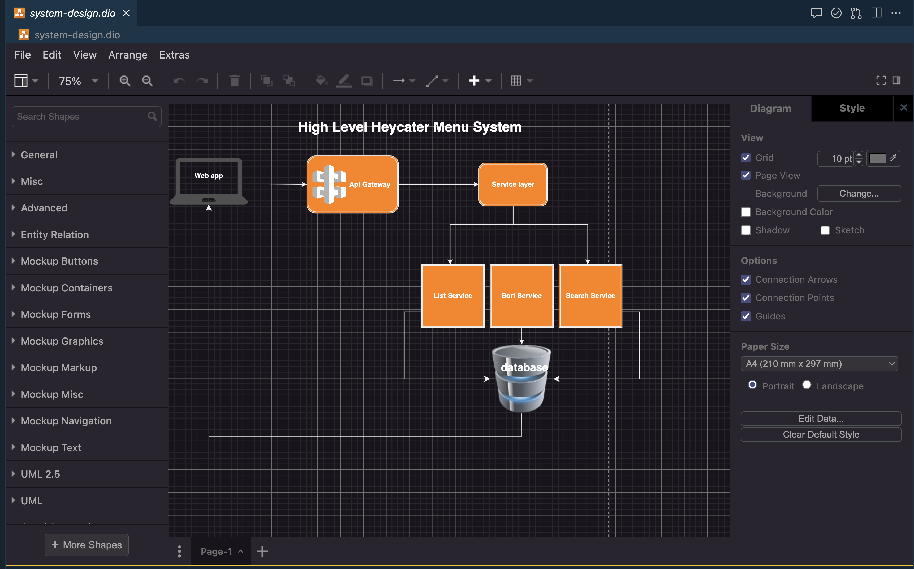
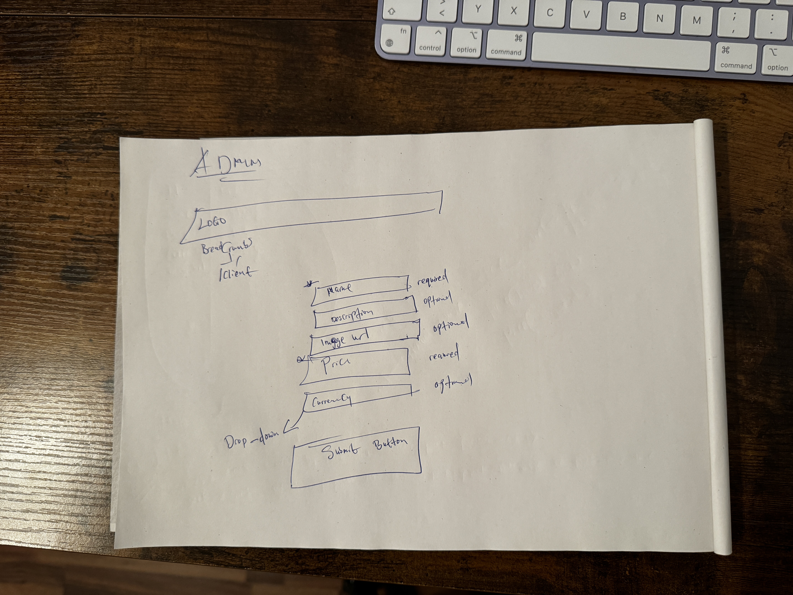

<div align="center">
  <a href="https://github.com/heycater-menu">
    
  </a>
</div>

<h1 align="center">HeyCater Menu</h1>

# About

HeyCater Menu is a catering market place.

* [Client App 🎨](./client/README.md)
* [Server App 📦](./server/README.md)

## [High level system design](./system-design.dio)


## [Db erm](./server/db-erm.dio)


## [Admin panel ideation](./client/src/__admin__/index.md)


## Get started

### Step 1 is to start up the Backend/Server

```bash
cd server # check into the server project

bundle # to install the gems with reference to the gem lock file

bin/rails server # the server will start up on local port 8080 http://localhost:8080
```

### Step to is to start the Frontend/Client

```bash
cd client # check into the client project

yarn # to install packages with reference to package lock file

.env # create a .env file and paste this variables into it. Note i wouldn't document an env secret credentials in a Readme. But for the sake of this task and it not being a secret credentials, then its okay to do so.
REACT_APP_HEYCARTER_MENU_CLIENT_URL="http://localhost:3000/"
REACT_APP_HEYCARTER_MENU_SERVER_URL="http://localhost:8080/v1/"

yarn run dev # this will start up the on local port 3000 http://localhost:3000. The app has an admin(http://localhost:3000/admin) and client site(http://localhost:3000)
```

## Features

### Admin App


### End User App
